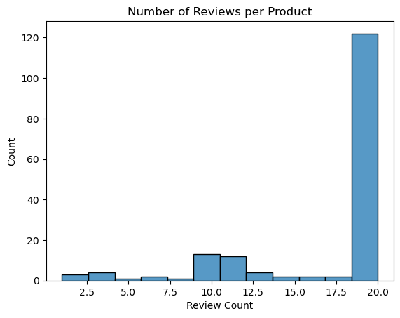
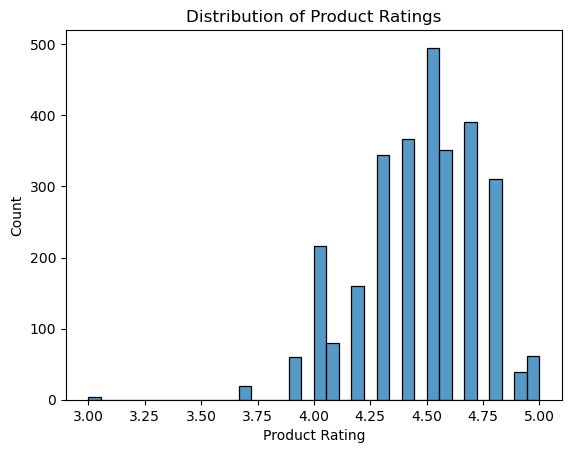
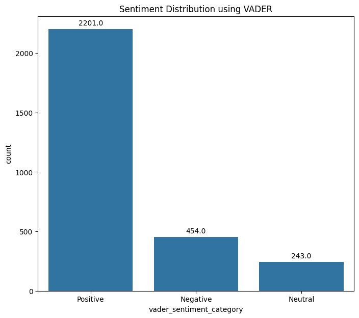
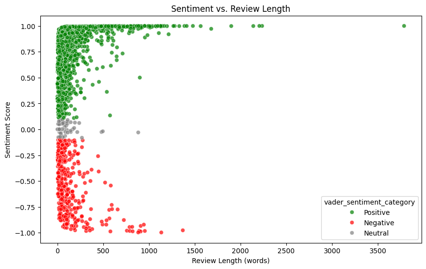

# Amazon Reviews Sentiment Analysis Dataset


## Description
This repository contains the code that was used to scrape Amazon for their product reviews in the Electronics department.

The dataset is available on [Kaggle](https://www.kaggle.com/datasets/laxman22/amazon-product-reviews-for-sentiment-analysis) and this repository can be used to extend the functionality of this dataset. Unit tests are also present in the ```unittests.py``` file.

In order to run this code successfully, you must download the dataset from Kaggle with the name ```ProductReviews.csv``` but do not create another empty file named ```links.csv```. The scraper will automatically create the file which will be used in order for the scraper to keep track of the links traversed so the scraper can continue where it left off in case of any interruptions.

The ```exploratory_data_analysis.py``` can be used to visualize some of the data analysis performed on this dataset to get a sense of what the dataset consists of.

The ```webscraper.py``` file can then be used and adapted to run the web scraper and expand on the dataset if necessary. The code will need to be changed in order to run successfully.

## Executive Summary

### Motivation
The motivation for curating this dataset came from researching existing publicly available datasets for performing sentiment analysis on Amazon products as this is valuable information for sellers and buyers.

There was an existing dataset that had Amazon reviews for training NLP (Natural Language Processing) models and other datasets that just had star ratings.

This inspired the creation of a more comprehensive dataset that tracks not only the reviews and the ratings they gave, but also the products that correspond to the reviews as well as the overall rating of the product and the number of ratings for that product.

While there isn't a ton of data present in this dataset, it provides a solid foundation to build off of and continue expanding the dataset.

### Applications
There are some key ways that this dataset can be applicable, primarily in 2 of the following ways provided a model could be trained on this dataset successfully. This could provide buyers and sellers with detailed analytics on how certain products perform and common complaints.

1) Suppose a seller would like to analyze their store's performance (or a competitors' performance). This model could provide information for specific products that were successful. For example, maybe a seller that sells phone cases sees that their iPhone 15 cases sold the most in their store, they would be able to dig into that specific product and pinpoint what exactly customers liked about the case. It's possible a manufacturing process changed for the iPhone 15 cases that customers mention with "better quality" in their reviews which is a good sign to continue doing so for other products. Maybe customers complained of poor shipping time or quality, which tells the seller exactly what to change to improve customer satisfaction.

2) As a buyer, if I could run a browser extension that could show me what the most common complaints are for a product, it would streamline the purchasing process for me. Furthermore, if people who are not well-versed in technology come across a product they like, this model could tell this person that a certain feature was missing or poorly executed according to customer feedback.


## Power Analysis
The power analysis I conducted determined that I would need ~180 positive and negative reviews per product. However, this was quite unfeasible as I wanted to prioritize product diversity over review diversity. Also, a lot of products didn't have that many reviews, which would affect the distribution of reviews. Furthermore, Amazon has strict limitations on how much data can be scraped so in the interest of time, breadth of products was prioritized over review depth for each product.

Therefore, I opted for collecting the top 10 positive and top 10 critical reviews for each product. This would be a relatively small sample of reviews that wouldn't contain the most polarizing reviews. However, it maintains a good distribution of data and captures a variety of products. If certain products did not have 20 reviews 5 reviews of each type were collected.

Finally, it would have been beneficial if the dataset included reviews across 1, 2, 3, 4, 5 star ratings however, this was also challenging due to Amazon's strict scraping policies.

## Exploratory Data Analysis

Below is the exploratory data analysis of this dataset which was performed in order to get an idea of what the distribution looks like for this data, along with prexisting sentiment analysis techniques with VADER.



Above, the number of reviews per product can be seen and it's clear to see that most products had 20 reviews stored but for products that didn't contain 20 reviews, less were collected. Most notable, 10 reviews per product were the next common after 20.



Next, the distribution of product ratings is shown and it's evident that all of the ratings were above 3 stars. This skew in the data comes from the fact that reviews that Amazon labels as "Critical" tend to be categorized by the content in the reviews as critical and not necessarily negative.

In addition, the skew could be present due to the bias in Amazon itself, it is possible that the ratings and reviews are inflated. There may also be a tendency for Amazon reviewers to make reviews for products that are really good rather than negative. Also, the skew also exists because a lot of products had negative ratings however, there were no reviews associated to it which can introduce additional biases.

Furthermore, there have been numerous reports of fake Amazon reviews with a product discount as an incentive, which can also artificially inflate product ratings.



After running the VADER sentiment analysis tool (which can analyze the text descriptions of reviews), it is clear to see from the plot above that most of the reviews were identified as positive by the tool  but there are a fair number of neutral and negative reviews. 

Approximately 24% of this dataset has neutral or negative reviews. Considering that overall, the products were not rated below a 3/5 suggests that the critical reviews are certainly valuable in providing insights into what improvements could be made in various products.


Finally, the VADER sentiment analysis tool can also measure how positive or negative a particular review is with a sentiment score. The above plot shows the sentiment score of all the reviews compared with the review length. 

One thing to note is that most of the reviews are in fact positive and mostly shorter in length. However, the outliers show an interesting pattern, the super long reviews tend to be super positive when compared with the negative reviews. This could indicate some fake reviews as a lot of super positive reviews are not necessary to convey the positive message.


## Ethics Statement

All of the data collected was from publicly available sources and in complaince with Amazon's Terms of Service. There is no PII (Personal Identifying Information) and there are certain biases that were identified and acknowledged in this study. This dataset is intended for educational and research purposes only, and it should not be used to harm anyone or sell anything.

## Instructions

The first step required to run this code successfully is to download the dataset which can be found here on [Kaggle](https://www.kaggle.com/datasets/laxman22/amazon-product-reviews-for-sentiment-analysis)

Then, clone this repository into your machine
```bash
git clone https://github.com/laxman-22/Amazon-Product-Reviews-Sentiment-Analysis.git
```
Next, create and start a virtual environment
```bash
python -m venv venv
source venv/bin/activate
```
Install all the requirements necessary
```bash
pip install -r requirements.txt
```
Now unit tests can be run from the ```unittests.py``` file and the scraper itself can be run from ```webscraper.py```. Finally, the exploratory data analysis can be ran from the ```exploratory_data_analysis.py``` file.

## License
Dataset License

[CC0: Public Domain](https://creativecommons.org/publicdomain/zero/1.0/)

Github Repository License

[MIT License](LICENSE)